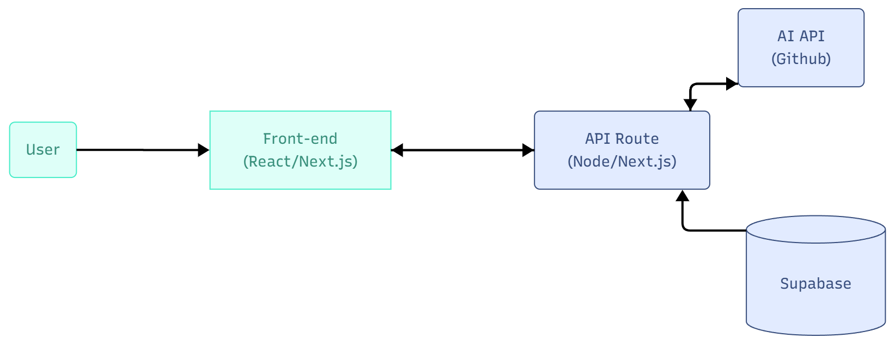

# 📝 SmartNote AI

A full-stack note management application with automatic tag suggestions powered by artificial intelligence.

## 🎯 About the Project

**SmartNote AI** is a modern application that combines note management with the power of artificial intelligence to automatically organize and categorize your content. When creating or editing a note, the AI analyzes the text and suggests relevant tags or automatic summaries, making it easier to organize and search for information.

## ✨ Features

### 📋 Complete CRUD for Notes
- ✅ Create, view, edit and delete notes
- ✅ Each note has title, body and creation date
- ✅ Organized and intuitive listing
- ✅ Persistent storage via Supabase

### 🤖 Integrated AI
- 🏷️ Automatic tag suggestions based on content
- 📄 Automatic summary generation
- ✏️ Ability to accept, edit or remove suggestions
- 🔍 Filters and search by tags

## 🏗️ Architecture

The project follows a modern full-stack architecture:

1. **Frontend (React/Next.js)** - Responsive and intuitive user interface
2. **API Routes (Next.js)** - Serverless backend for business logic
3. **Supabase (PostgreSQL)** - Robust and scalable database
4. **AI API (GitHub/OpenAI)** - Natural language processing for intelligent suggestions



### Data Flow

```
User → Frontend → API Route → Supabase (saves note)
                      ↓
                 AI API (analyzes text)
                      ↓
                Frontend ← (returns suggestions)
```

## 🛠️ Technologies

- **Next.js 15** - React framework with App Router
- **React 19** - UI library
- **TypeScript** - Static typing
- **Supabase** - Backend-as-a-Service (PostgreSQL)
- **Tailwind CSS 4** - Styling
- **AI API** - Tag/summary generation

## 🚀 How to Run

### Prerequisites

- Node.js 20+
- [Supabase](https://supabase.com) account
- AI API Key (GitHub Models, OpenAI, etc.)

### Installation

1. Clone the repository
```bash
git clone https://github.com/htonioni/smart-note-ai.git
cd smart-note-ai
```

2. Install dependencies
```bash
npm install
```

3. Configure environment variables

Create a `.env.local` file:
```env
NEXT_PUBLIC_SUPABASE_URL=your_supabase_url
NEXT_PUBLIC_SUPABASE_ANON_KEY=your_supabase_anon_key
SUPABASE_SERVICE_ROLE_KEY=your_service_role_key
AI_API_KEY=your_ai_api_key
```

4. Run the development server
```bash
npm run dev
```

5. Open [http://localhost:3000](http://localhost:3000) in your browser

## 📦 Production Build

```bash
npm run build
npm start
```

## 🗄️ Database Schema

```sql
CREATE TABLE notes (
  id UUID PRIMARY KEY DEFAULT uuid_generate_v4(),
  title TEXT NOT NULL,
  content TEXT NOT NULL,
  tags TEXT[],
  summary TEXT,
  created_at TIMESTAMP DEFAULT NOW(),
  updated_at TIMESTAMP DEFAULT NOW()
);
```

## 🎨 Future Features

- [ ] Dark/light theme
- [ ] Note sharing
- [ ] Export in multiple formats
- [ ] Advanced search and filters

## 📄 License

This project is for educational and demonstration purposes.

## 👨‍💻 Author

**Hugo Tonioni** - Software Developer  
📧 **Email**: htonioni@outlook.com  
🔗 **LinkedIn**: [linkedin.com/in/htonioni](https://linkedin.com/in/htonioni)  
💻 **GitHub**: [github.com/htonioni](https://github.com/htonioni)

Developed to demonstrate skills in modern full-stack development, AI integration, and software architecture best practices.

---

⭐ If this project was helpful, consider giving it a star!
