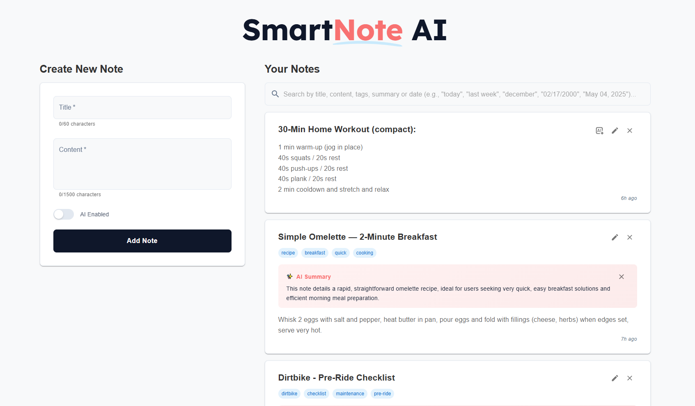
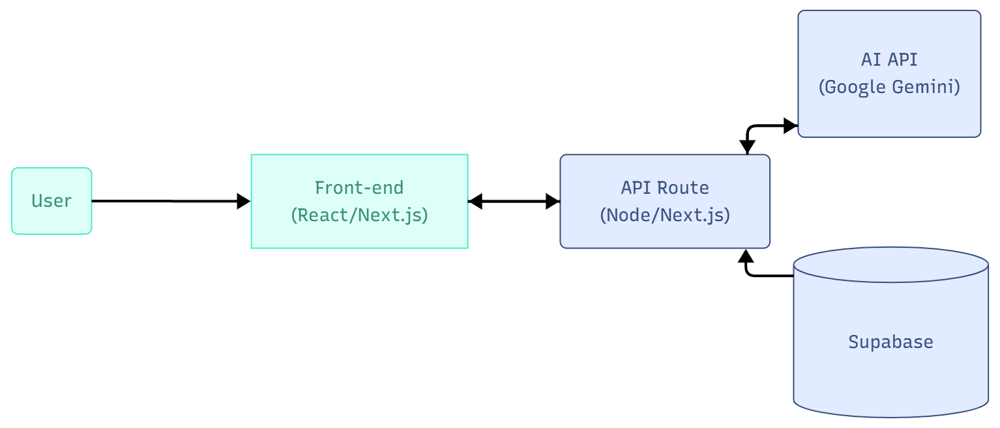

# 📝 SmartNote AI

A modern, full-stack note management application with intelligent AI-powered organization and beautiful user experience.



## About the Project

**SmartNote AI** represents the perfect blend of modern web development and artificial intelligence. This sophisticated note-taking application doesn't just store your thoughts—it understands them. Using advanced AI analysis, SmartNote automatically categorizes your content, generates meaningful summaries, and provides intelligent insights that transform how you organize and retrieve information.

Built with the latest web technologies and a focus on user experience, SmartNote AI demonstrates enterprise-level development practices while maintaining an intuitive, responsive interface that works seamlessly across all devices.

## Features

### 📋 Complete Note Management
- **Full CRUD Operations** - Create, view, edit and delete notes seamlessly
- **Rich Text Support** - Preserve line breaks and formatting in note content
- **Smart Organization** - Notes display with title, body, tags, and timestamps
- **Date Management** - Automatic timestamps with relative time display ("2 hours ago")
- **Responsive Design** - Works perfectly on desktop, tablet, and mobile devices

### Advanced AI Integration
- **Intelligent Tag Generation** - AI analyzes content and suggests 3-4 relevant tags
- **Smart Summary Creation** - AI generates insightful summaries focusing on purpose and context
- **Flexible AI Control** - Toggle AI features on/off when creating notes
- **Post-Creation AI** - Generate AI tags and summaries for existing notes
- **Summary Management** - Delete AI summaries while keeping manual content
- **Context-Aware Analysis** - AI provides meaningful insights, not just content repetition

### Enhanced Search & Navigation
- **Real-Time Search** - Instant filtering as you type across titles, content, tags, and summaries
- **Search Results Counter** - See exactly how many notes match your query
- **Tag-Based Filtering** - Click tags to filter notes by category
- **Scroll to Top** - Smooth scroll button for easy navigation on long lists
- **Visual Feedback** - Clear "no results" states and loading indicators

### Modern User Experience
- **Beautiful Animations** - Smooth card animations and hover effects
- **Professional Modals** - Clean, Apple-like design for edit and delete actions
- **Loading States** - Professional loading indicators for all async operations
- **iOS-Style Toggles** - Modern switch controls for AI features
- **Custom Skeletons** - Realistic loading placeholders that match actual content
- **SVG Underlines** - Stylish visual elements in the header design

### Robust Data Management
- **Persistent Storage** - All data securely stored in Supabase PostgreSQL
- **Real-Time Updates** - Changes reflect immediately without page refresh
- **Data Integrity** - Comprehensive error handling and validation
- **Type Safety** - Full TypeScript integration for reliable data flow

## 🏗️ Architecture

The project follows a modern full-stack architecture:

1. **Frontend (React/Next.js)** 
2. **API Routes (Next.js)** 
3. **Supabase (PostgreSQL)** 
4. **AI API (Gemini - GenAI)**



### Data Flow

```
User → Frontend → API Route → Supabase (saves note)
                      ↓
                 AI API (analyzes text)
                      ↓
                Frontend ← (returns suggestions)
```

## 🛠️ Technologies

### Frontend Stack
- **Next.js 15** - React framework with App Router and modern features
- **React 19** - Latest UI library with enhanced performance
- **TypeScript** - Full static typing for development reliability
- **Material-UI (MUI)** - Professional component library with custom styling
- **CSS-in-JS** - Styled components with responsive design principles

### Backend & Database
- **Supabase** - Backend-as-a-Service with PostgreSQL database
- **Next.js API Routes** - Serverless backend functions
- **RESTful APIs** - Clean API design for data operations

### AI & External Services
- **Google Gemini AI** - Advanced natural language processing for tag and summary generation
- **Real-time AI Processing** - Instant content analysis and suggestions

### Development & Deployment
- **Modern JavaScript (ES2024)** - Latest language features
- **Component Architecture** - Modular, reusable component design
- **Custom Hooks** - Efficient state management patterns
- **Performance Optimization** - Loading states, animations, and smooth UX

## 🚀 How to Run

### Prerequisites

- Node.js 20+
- [Supabase](https://supabase.com) account
- [Google AI Studio](https://aistudio.google.com/) API key for Gemini

### Installation

1. Clone the repository
```bash
git clone https://github.com/htonioni/smart-note-ai.git
cd smart-note-ai
```

2. Install dependencies
```bash
npm install
```

3. Configure environment variables

Create a `.env.local` file:
```env
NEXT_PUBLIC_SUPABASE_URL=your_supabase_url
NEXT_PUBLIC_SUPABASE_ANON_KEY=your_supabase_anon_key
GEMINI_API_KEY=your_google_gemini_api_key
```

4. Run the development server
```bash
npm run dev
```

5. Open [http://localhost:3000](http://localhost:3000) in your browser

## 📦 Production Build

```bash
npm run build
npm start
```

## 🎨 Future Enhancements

- [x] ✅ **Smart AI Summaries** - Context-aware summaries that provide insights, not repetition
- [x] ✅ **Real-time Search** - Instant filtering across all note content
- [x] ✅ **Professional UI Components** - Modern modals and interactive elements
- [x] ✅ **Scroll to Top Navigation** - Smooth navigation for long note lists
- [x] ✅ **Line Break Preservation** - Maintain formatting in note display
- [x] ✅ **Loading State Management** - Professional loading indicators throughout
- [ ] 🔄 **Toast Notifications** - User feedback for actions and errors
- [ ] 📌 **Note Favoriting** - Pin important notes to the top
- [ ] 🏷️ **Advanced Tag Management** - Custom tag colors and organization
- [ ] 📱 **Progressive Web App** - Offline functionality and mobile app experience
- [ ] 🔍 **Advanced Search Filters** - Date ranges, tag combinations, and more
- [ ] 📤 **Export Functionality** - Export notes as PDF, Markdown, or JSON
- [ ] 👥 **Collaboration Features** - Share notes and collaborative editing

## 📄 License

This project is for educational and demonstration purposes.

## 👨‍💻 Author

**Hugo Tonioni** - Software Developer  
📧 **Email**: htonioni@outlook.com  
🔗 **LinkedIn**: [linkedin.com/in/htonioni](https://linkedin.com/in/htonioni)  
💻 **GitHub**: [github.com/htonioni](https://github.com/htonioni)

Developed to demonstrate skills in modern full-stack development, AI integration, and software architecture best practices.

---

⭐ If this project was helpful, consider giving it a star!
